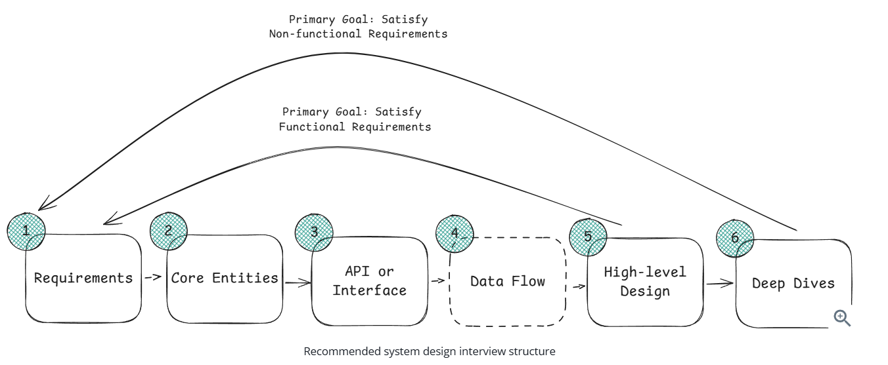
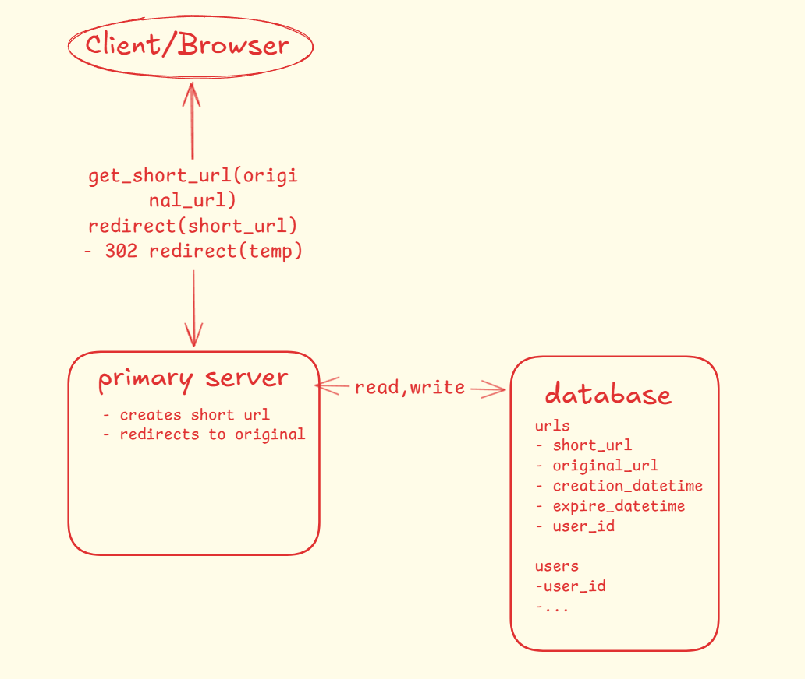

# Mitly - Modern URL Shortener

Mitly is a full-stack URL shortening service inspired by Bitly. This project consists of a FastAPI backend and a React frontend.

## Project Structure

```text
mitly/
├── backend/            # FastAPI Application
│   └── README.md       # Backend technical documentation
├── frontend/           # React + TypeScript Application
│   └── README.md       # Frontend setup & architecture docs
└── README.md           # Main project overview (this file)
```

### Table of contents

* [Project Overview](#project-overview)
* [Quick Start](#quick-start)
* [System Design](#system-design)
* [Development Workflow](#development-workflow)
* [Helpful stuff](#helpful-stuff)

# Project Overview

* **Tech Stack**: 
    * **Backend**: FastAPI, PostgreSQL, SQLAlchemy, Pydantic, Pytest
    * **Frontend**: React (Vite), TypeScript, TailwindCSS, Axios
    * **Tools**: `uv` (Python), `npm` (Node.js)

* **Summary**: Mitly allows users to transform long, clunky URLs into short, shareable links with optional expiration dates.

---

# Quick Start

### 1. Backend Setup
```shell
cd backend
uv venv --python 3.13
.venv\Scripts\activate
# Install dependencies and run
uv run mitly
```

### 2. Frontend Setup
```shell
cd frontend
npm install
npm run dev
```

The frontend will be available at `http://localhost:5173` and the backend at `http://localhost:8003`.

---

# System Design

# Development Workflow

Inside out approach (Data > Logic > Interface)  
database models > pydantic schemas > crud logic > fastapi endpoints > main.py entry point

[↑ Back to Top](#table-of-contents)

# System Design

## Delivery Framework



## -------------------- 1. Requirements

### Functional Requirements

Core features

1. create a short url from a long url
    - [optional] support expiration time
    - [skipped] support a custom alias
2. redirection to the original url from the short one

### Non-functional Requirements

Qualities like Scalability, Latency, Security, Fault Tolerance

1. Ensure **uniqueness**   
   We must guarantee that each short URL maps to exactly one long URL; otherwise users could be redirected to an
   unexpected website.

2. Low **latency** on redirects (~200 ms)

3. **Scale** to support:
    - 100M daily active users (DAU)
    - 1B stored URLs

4. **CAP Theorem** (Brewer's theorem says that **distributed systems** can guarantee only two guaranties at the same
   time)  
   **AP + eventual consistency** (Tech: Cassandra, DynamoDB)  
   eventual consistency means that updates propagate to all replicas over time  
   Because we would prefer the system to be always working, despite a node failure. Having the most recent data as soon
   as possible is not a priority.
    - ✅ Guarantee **[A]vailability**: (информацията винаги е налична, но не винаги е актуална) Every request receives
      a (non-error) response, even if a node has dropped, without the guarantee that it contains the most recent
      write/data.
    - ✅ Guarantee **[P]artition tolerance (устойчивост при разделяне)**: System continues to work even if network
      communication between nodes is interrupted
    - ❌ **[C]onsistency**: (информацията е винаги актуална, но не винаги е налична) All clients/nodes see the same data
      at the same time  
      Usecases: Banking, Stocks, Ticket booking system, etc.  
      Strong consistency guarantees that the following example will **NOT** happen:  
      p1 from EU buys last ticket to a concert and p2 buys it at the same time from US.

💡Note: [P]artition Tolerance is usually not optional in modern distributed systems because networks will eventually
fail

## -------------------- 2. Core Entities

- Original url
- Short url
- [optional] User

## -------------------- 3. API or Interface

💡 Tip: Functional Requirements hint the endpoints

- shorten url  
  POST /urls > short_url

```json
{
  "original_url": "https://github.com/miray-mustafov/mitly",
  "optional_alias": null,
  "optional_expiration_time": null
}
```

- redirect  
  GET {short_url} > redirect to original_url

```json
{
  "short_url": "https://mitly/asd123"
}
```

## -------------------- 4. Data Flow (skipped)

## -------------------- 5. High-level Design



## -------------------- 6. Deep Dives

todo

[↑ Back to Top](#table-of-contents)

# Low Level Design Implementation

[backend/low_level_design/url_shortener.py](backend/low_level_design/url_shortener.py)

[↑ Back to Top](#table-of-contents)

# Setup

Local setup for Windows OS

### Open terminal, navigate to a desired folder, and run:

```shell
git clone git@github.com:miray-mustafov/mitly.git
```

### Navigate to root level of the project:

```shell
cd mitly
```

### Configure and activate python virtual environment

```shell
uv venv --python 3.13
.venv\Scripts\activate
```

*Note: If uv not installed ```powershell -ExecutionPolicy ByPass -c "irm https://astral.sh/uv/install.ps1 | iex"```

### Create local .env file next to .env.example:

### Setup postgres database(suggested command in .env.example):

### Run the app:

```shell
uv run mitly
```

[↑ Back to Top](#table-of-contents)

# Helpful stuff

run tests locally at root level:

```shell
uv run pytest
```

[↑ Back to Top](#table-of-contents)